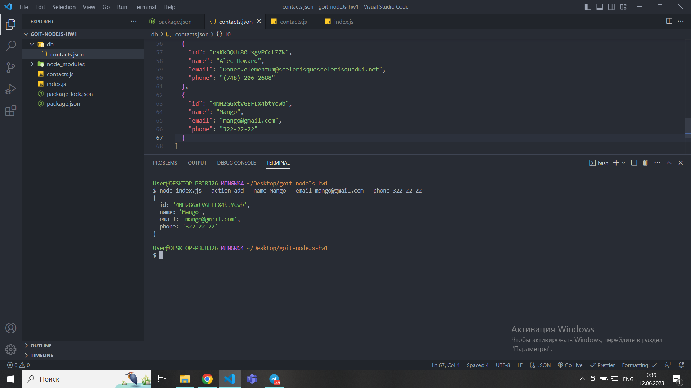

# Available commands in the terminal

## Receive and display the entire list of contacts in the form of a table (console.table)

```javascript
node index.js --action list
```


## Receive a contact by id

```javascript
node index.js --action get --id 05olLMgyVQdWRwgKfg5J6
```


## Add a contact

```javascript
node index.js --action add --name Mango --email mango@gmail.com --phone 322-22-22
```



## Delete the contact

```javascript
node index.js --action remove --id qdggE76Jtbfd9eWJHrssH
```


